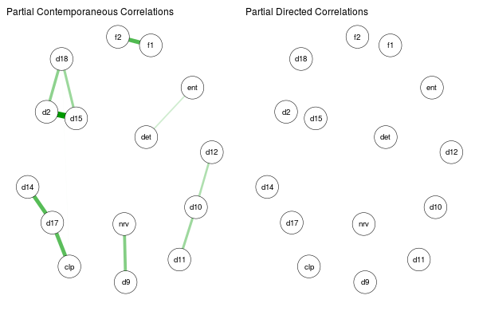

```{r setup, include=FALSE}
knitr::opts_chunk$set(echo = FALSE, message = FALSE, warning = FALSE, cache = TRUE)
```


```{r dados}
ac <- read.csv2("acompanhamento.csv", encoding = "UTF-8")
colnames(ac)[1]<- "Start.Time"
ac$energia_agora <- as.numeric(ac$energia_agora)
#data
library(lubridate)

ac$Start.Time <- ymd_hms(ac$Start.Time)
ac$dia <- round_date(ac$Start.Time, unit = "day")
ac$hora_acordou <- hms(ac$hora_acordou)
ac$hora_dormiu <- hm(ac$hora_dormiu)
ac$correu_hoje[ac$correu_hoje == 1] <- "S"
ac$tempo_sono <- as.numeric(hms(ac$tempo_sono))
ac$energia_agora <- as.numeric(ac$energia_agora)

library(spacetime)
ac$energia_agora <- spacetime::na.approx(ac$energia_agora)
#ac$trabalho_tempo <- na.approx(ac$trabalho_tempo)
ac$trabalho_tempo[1] <- 0
```


## Método

Eu usei um método chamado Experience Sampling Method. Basicamente, eu me apliquei um questionário quatro vezes ao dia. A maioria das perguntas eram as mesmas, mas tinham algumas que eu só fazia no primeiro teste (de manhã) e no último teste (de noite).


## Gráficos

### Qual o nível geral de energia agora?

Com esta pergunta eu queria testar se encontraria uma baixa durante uma semana e uma alta nas demais. Ainda é algo que preciso de dados de mais alguns meses, mas acho que já dá ver alguma coisa.

No eixo x estão os dias, no eixo y estão os níveis relatados de energia, que eram uma escala analógica de 0 a 100%. Os pontos são os dados reais, e a linha é uma linha de tendência pra deixar mais interpretável.

```{r}
library(ggplot2)
library(plotly)
gg <- ggplot(ac) +
  geom_jitter(aes(x = Start.Time, y = energia_agora)) +
  geom_smooth(aes(x = Start.Time, y = energia_agora))
ggplotly(gg)
```

Pelo resultado, eu *acho* que existe uma diferença grande entre os níveis de energia no começo do dia e no final. Então, no próximo gráfico, vou tirar os dados do primeiro teste do dia. Então, parece que não há muita mudança, mas parece que os pontos debaixo são os da noite.

```{r}
library(ggplot2)
library(plotly)
gg <- ggplot(ac[ac$qual_teste > 1, ]) +
  geom_jitter(aes(x = Start.Time, y = energia_agora)) +
  geom_smooth(aes(x = Start.Time, y = energia_agora))
ggplotly(gg)
```

Então, faz bastante sentido que eu tenha menos energia de manhã e à noite, e o mais importante é o nível de energia durante o dia. Por isso, no próximo gráfico fiz somente com os testes do meio.

```{r}
library(ggplot2)
library(plotly)
gg <- ggplot(ac[ac$qual_teste == 2, ]) +
  geom_jitter(aes(x = Start.Time, y = energia_agora)) +
  geom_smooth(aes(x = Start.Time, y = energia_agora))
ggplotly(gg)
```
Parece que vai na direção de corroborar com a minha hipótese: queda de energia começando no dia 10, com pico no dia 13+- e que começa a se recuperar no dia 15~16.

### Rede

Aqui está a parte divertida. Não acho que a gente deva levar isso *muito* à sério, porque é um método muito experimental ainda. Mas acredito que a gente pode usar pra gerar hipóteses, caso apareça algo que faça sentido.

Nos questionários eu coloquei a DASS-21, que mede ansiedade e depressão. Então, estou fazendo um gráfico de redes. Neste gráfico, cada um dos itens da DASS está sendo representado por nodos (as bolinhas) e a correlação entre as variáveis são as linhas que conectam os nodos. Se dois nodos estão conectados por uma linha azul, então eles tem uma correlação positiva, quando eu respondo mais alto em um item, eu tendo a responder mais alto no outro também. Os nodos conectados por linhas vermelhas indicam que uma relação inversamente proporcional -- respondo alto em um e baixo no outro, e vice-versa! Cores mais fortes/linhas mais grossas indicam relações mais poderosas.

Neste gráfico os elementos também tem importância espacial. Isso quer dizer que o fato de mais variáveis estarem juntas, significa que elas são mais conectadas entre si. E variáveis mais separadas, são menos conectadas. Isso é bem importante por que a gente sabe que pelo menos para depressão, uma rede com variáveis mais conectadas dá uma pré-disposição para deflagrar episódios depressivos. Por que se um sintoma aumenta, ele tende a aumentar os sintomas próximos, que ativam outros. Já numa rede mais desconectada, a pessoa pode ter muito um sintoma, mas como ele não está muito conectado com os demais, não gera esse efeito dominó.

Outra coisa importante é que nesta rede nós temos um tipo de correlação especial onde o efeito de uma variável sempre está controlado pelo efeito de todas as demais. Com isso, se uma relação aparece na rede, essa relação não pode ser explicada pelo efeito de nenhuma outra variável na rede. Por exemplo, se houver uma ligação entre eu me sentir nervoso e ter a boca seca, isso não pode ser explicado pelo meu consumo de café ou por eu não estar me valorizando como pessoa naquele momento. Isso permite que a gente veja o caminho que os sintomas fazem. Por exemplo, pode ser que consumo de café esteja relacionado com eu me sentir mais agitado -> que está conectado com ter dificuldade de respirar -> que se conecta com me sentir nervoso; então existiria um caminho entre café e 'nervosismo', por mais que os dois não estejam diretamente relacionados.

Também vão existir duas redes. A primeira diz sobre coisas que acontecem instantâneamente. Se duas variáveis estão conectadas, então as duas variáveis mudam juntas ao mesmo tempo (ou pelo menos não dá pra saber se uma leva a outra). Na segunda rede, são coisas que aconteceram entre os testes, então coisas que mudam em algumas horas. Seria nessa que eu esperaria ver algo como café levando a mais ansiedade. Nesta, as coisas seriam direcionadas, dariap pra saber a ordem dos eventos (mas nela, nada ficou conectado, então podemos ignorar).

Ah, outra coisa importante é que eu respondi bem baixo em quase tudo (sempre 1 ou 2). Então as coisas se ligarem não significa necessarimente que são sintomas muito presentes. Só que quando eles mudam alguma coisinha (de um 1 pra 2, por exemplo), outros também costumam mudar juntos.


```{r}
library(graphicalVAR)
library(lubridate)
tmp <- ac[, c(3, 19, 21, 22, 26, 29:30, 33:41, 43:46)]
#tmp$dia <- as.character(tmp$dia)
labels = c("tst", "enrg", "café", 1, 4, 5, 8:16, 18:20, "dia")
gvar1 <- graphicalVAR(tmp, dayvar = "dia", lags = 1, verbose = FALSE)
library(qgraph)
plot(gvar1, labels = labels)
```

#### Legenda

1-Estou percebendo que estou com a boca seca |0 - Não se aplica a mim de forma alguma|1 - Aplica-se a mim de alguma forma|2 - Aplica-se a mim de forma considerável|3 - Aplica-se muito a mim

2-Não estou conseguindo ter nenhum sentimento positivo

3-Estou experimentando dificuldade em respirar (por exemplo: respiração excessivamente rápida, falta de ar na ausência de esforço físico)

4-Estou achando difícil ter iniciativa para fazer as coisas

5-Estou tendo reações exageradas às situações

6-Estou tendo tremores (por exemplo: as pernas bambas)

7-Estou achando difícil relaxar

8-Noto que estou ficando agitado

9-Estou me sentindo bastante nervoso(a)

10-Estou sentindo  que não tenho muito valor como pessoa

11-Estou me sentindo assustado sem qualquer razão

12-Estou tendo dificuldades em me acalmar

13-Eu estou ciente do meu batimento cardíaco na ausência de esforço físico

14-Estou sentindo que não tenho expectativas positivas a respeito de nada

15-Estou me sentindo abatido e triste

16-Não estou tendo paciência com nada que interrompa o que eu estou fazendo

17-Sinto que estou prestes a entrar em pânico

18-Não estou conseguindo me empolgar com qualquer coisa

19-Estou me sentindo muito irritado

20-Estou sentindo que a vida não tem sentido

#### Interpretação

Acho que o primeiro ponto muito positivo é que as variáveis de depressão quase não se conectaram com nada. 

Já na ansiedade xiste uma 'corrente' que liga quase todos os sintomas mais físicos. Boca seca (1) está muito ligada à irritação (19). Boca seca está ligada também à não ter expectativas positivas (14) e dificuldade de me acalmar (12). Então não existe uma ligação direta entre irritação, dificuldade de me acalmar e as expectativas, mas estas coisas andam meio ligadas, principalmente quando também sinto que a boca está seca.

O outro sintoma que faz ponte com vários outros é estar ciente dos batimentos cardíacos (13). Ele está ligado à dificuldade me acalmar (12), o que acaba fazendo a ponte com os sintomas de cima e com os debaixo: sentir-se nervoso, sentir que não tenho valor, e falta de paciência com coisas que interrompam o que eu tô fazendo. E me sentir nervoso está conectado também à me sentir assustado.

Pensando num sentido de intervenção, eu olharia primeiros pros sintomas-ponte, por que mudar eles mudaria todo o resto da rede. Infelizmente um é sentir os batimentos cardíacos, então não dá pra mudar. O outro é justamente a dificuldade de me acalmar. Pensando em maneiras de ajustar esse, talvez achar algo pra relaxar quando eu estiver com dificuldade de me acalmar já mudaria muita coisa -- por mais que seja meio óbvio :p

Vou botar abaixo a minha rede de quando participei da pesquisa com a Marcele. Alguns dos mesmos sintomas aparecem, mas a diferença é que agora eles estão bem menos conectados em geral, o que é ótimo!



### Café

Pela rede, parece que não existe relação entre os itens de ansiedade e a quantidade de café. Mas só pra ter uma certeza maior, vou fazer um gráfico de dispersão entre a quantidade de café e o item 9 da DASS-21, "Estou me sentindo bastante nervoso(a)".

Como eu também quero saber se o café me ajuda a ter mais energia, vou fazer a mesma coisa para café e energia.

#### Café x DASS 9

Aqui eu usei um boxplot. Nele, se as caixinhas estiverem mais ou menos na mesma altura, as variáveis tem uma distribuição muito parecida. Daí não daria pra afirmar que mais ansiedade está relacionada a mais café ou não e é o que acontece. Seria diferente se uma caixinha estivesse muito mais alta ou mais baixa do que a outra.

```{r}
library(ggplot2)
library(plotly)
tmp <- ac
ac$dass.9 <- as.factor(ac$dass.9)
gg <- ggplot(tmp) +
  geom_boxplot(aes(x = dass.9, y = café), color = "red")
ggplotly(gg)
```

#### Café x Energia

```{r}
library(ggplot2)
library(plotly)
gg <- ggplot(ac) +
  geom_jitter(aes(x = energia_agora, y = café)) +
  geom_smooth(aes(x = energia_agora, y = café))
ggplotly(gg)
```

Pelo visto não parece que influencia naquela pergunta, e tem alguma influência na energia :)
Por outro lado, parece que não adianta nada passar de 200~300g. Depois até parece que piora passando disso, o que faz sentido, já que eu devo estar com energia mais baixa e isso me leva a consumir mais café ao longo do dia, mas tem um máximo em que isso me ajuda. Mas preciso de mais dados pra confiar nisso.

